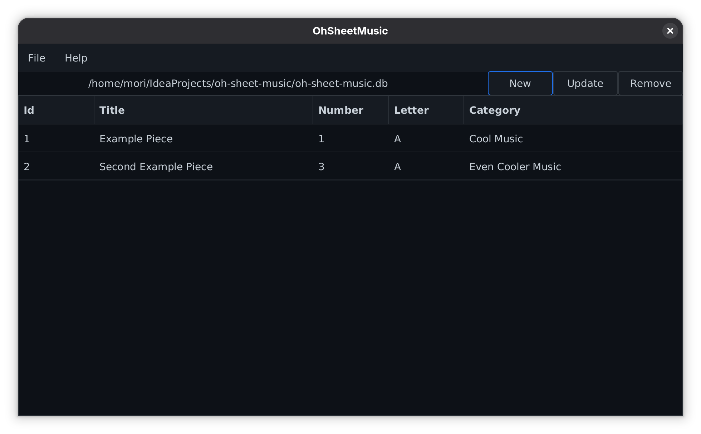

# Oh Sheet Music

Oh Sheet Music, or "Oh S**** Music", is a tool to manage the sheetmusic in paperform at my local orchestra. 
I wrote this because i found no tool for exaclty that purpose with only that purpose. I wanted a clean simple solution.

You can add, update and remove pieces. Then export them to a pdf to put it in the box with the paper.

## To-Do (not implemented yet)
- more themes
- more pdf export options (e.g. sort by category, splitt categories to different tables)
- remote database
