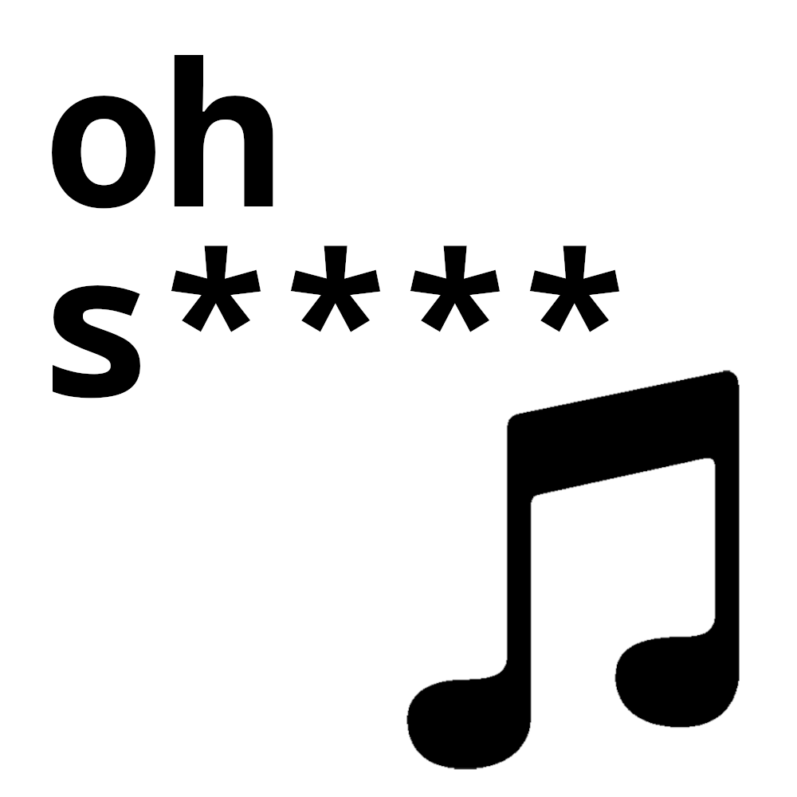

# Oh Sheet Music

  

**Oh Sheet Music**, or "Oh S**** Music" (depending on whether you could or couldn't find your stuff during rehearsal), is a tool to manage physical sheet music for my local orchestra. 

I wrote this because I couldn't find a tool that fit my specific use case, and I was bored.

### How it works
The system uses a register box with numerical categories (e.g. 01, 02, 03, 04). Within those numerical categories, pieces are further organized alphabetically from A to Z.

You can add, update, and remove pieces from the list, then export them to a PDF to keep with the physical box. The list of pieces is stored in a separate database file.

To find a piece, you simply look at the printed document to find the corresponding **Number** and **Letter**, and there you have it!

## Installation
You are on your own:/

## Currently Supports
- **Piece Management:** Add, update, and delete entries.
- **Database Integration:** Save and load the register from a database file.
- **PDF Export:** Simple export functionality.

## To-Do (Not yet implemented)
- More themes
- Advanced PDF export options (e.g. sort by category, split categories into different tables)
- Search function
- Automatic saving
- Remote database support
